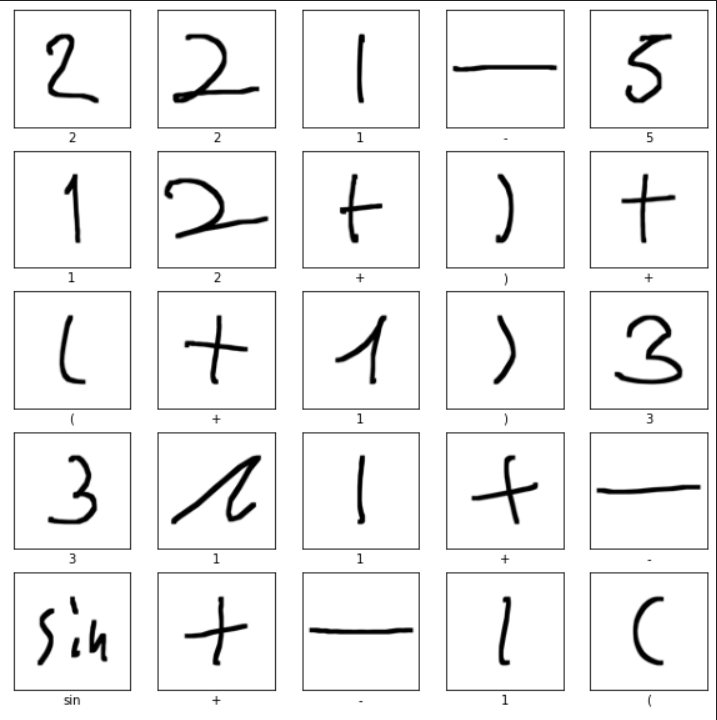

# HandwritingCalculator

We're creating a calculator with GUI that recognizes handwritten math expressions and evaluate them.

## Motivation

It would be handy to have a calculator which evaluates handwritten math.

## Testing

you can go to calculator directory and run following command:

main.py [-h] [-t test image path] [-m model path]

optional arguments:
-h, --help          show this help message and exit
-t test image path  testing image on given path
-m model path       set classifier model specified on given path

### example usage:

- main.py

- main.py -t samples/sample1.PNG

## Dataset

We used CROHME 2014 dataset compiled by Harold Mouchère.

The dataset is licensed under a Creative Commons Attribution-NonCommercial-ShareAlike 3.0 Unported License.

## How we trained CROHME 2014 dataset

We first preprocessed dataset to become 100 x 100 images, and created label ranging from 0 to 21.

We used dilation method to thicken the line strokes, and added padding to make the square image before resizing to 100 x 100.

Then we splitted the datset into train set and test set (80% 20%).

To train our dataset, we built a Convolutional Neural Network(CNN) using tensorflow-keras.

The network architecture is inside network.py

## Contributors

Hosung Lee

Andrew Hung

Spencer Bass

## Acknowledgements

Harold Mouchère, ICFHR 2014 CROHME: Fourth International Competition on Recognition of Online Handwritten Mathematical Expressions (CROHME-2014) ,2,ID:CROHME-2014_2,URL:http://tc11.cvc.uab.es/datasets/CROHME-2014_2

## License
Creative Commons Attribution-NonCommercial-ShareAlike 4.0 International (CC BY-NC-SA 4.0)
